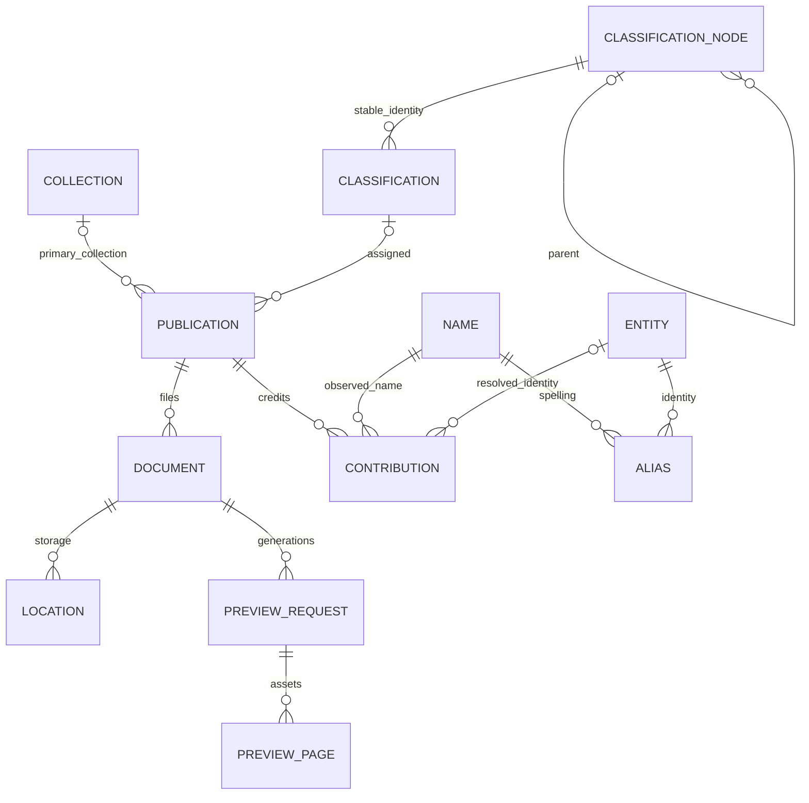

# Shared Library catalog

The normalized catalog is implemented in `app/catalog/`. Both a separate admin
backend and Manzara workers can use `CatalogRepository` without importing each
other's application or flow internals. Alembic remains the only schema owner.

Installation is additive. Import prepares a staging catalog; explicit activation
switches existing tasks to transactional catalog adapters. **Do not enable the
admin service against staging data while original writers run.** Import alone
does not activate adapters. No live data is changed by code review or read-only
preflight.

Upgrade Alembic to its current head before importing. A forward repair supplies
the proposal-member row identity, composite primary keys, and lookup/search
indexes omitted by the first deployed catalog schema; existing rows are
preserved and duplicate identities stop the repair for review. Ordinary upgrades leave task adapters
dormant until explicit activation.

After lean retirement, normalized relations own editable domain data. The seven
old document, metadata, classification, identity, alias, collection, and membership
tables are removed with explicit `DROP TABLE ... RESTRICT` commands. Their names
become lightweight views over the catalog. Existing task SQL is a command
interface: ordinary writes use transactional view triggers; upserts use the
strict `catalog_upsert` command because views have no unique indexes.
The views store no duplicate domain rows. Retained workflow tables keep their
records and have their foreign keys validated against normalized identities.
Concurrent commands reject outdated snapshots instead of overwriting newer data.
The earlier full-evidence import and stored-projection mode remains available
for already reviewed staging/recovery scenarios; it exceeds this service's 1 GB
quota and must not be used for this production transition.
Task writes to protected publication fields enter the metadata review queue.
Protected file/privacy or collection conflicts fail with a reviewable error.
Normalization retains unconfirmed hypotheses and never sweeps matching names
into a resolved identity. Explicit existing owner change sets remain owner
commands. New identity suggestions and publisher clusters enter the shared
review queue; decisions update their original workflow checkpoints.

## Object model



A publication represents an edition, translation, or issue. Each imported file
initially receives its own publication. ISBN duplicates remain intact. Grouping
requires reviewed source revisions and explicit resolutions for differing
metadata and relation sets. Document MD5 identities do not change.

Publications own inclusion, title, edition, publication-date precision, languages,
identifiers, genre, audiences, subjects, credits, source-work references, one
classification, and one primary collection. Documents own file selection,
completeness, access restrictions, MIME type, accessibility, and storage locations.
Collections have a separate publishing switch. Inclusion never overrides file
privacy or completeness.
Unknown legacy privacy is imported as restricted, preserving public-export
exclusions until an owner or verified source resolves it.

People and organizations share an identity registry. Directories filter by kind
and contribution role. Human confirmation is separate from active/merged status
and AI success. Raw names remain separate observations. A spelling may belong to
multiple identities; assigning an alias never resolves every matching occurrence.
Contribution resolution explicitly identifies the reviewed mention.
Publisher review proposals and separation decisions derive name types from
publisher mentions, then publisher aliases. A matching author spelling does
not change the publisher's type.

Taxonomy uses parent-child nodes and preserves legacy classification IDs.
Renaming a branch changes generated paths. DDC and CategoryPath export terms
derive from the assigned tree; source values remain available as import evidence.

Editable bibliographic data lives in columns and relations. Schema.org is a
generated transport format. JSONB holds source evidence, immutable review
snapshots, proposals, import manifests, and audit revisions. Legacy workflow checkpoints remain in their durable tables, not copied into
import evidence or represented as new approvals. Import manifests retain source
counts and fingerprints. Sparse evidence preserves unmapped columns and original
values changed by privacy, language, or taxonomy normalization; the verified
external backup preserves the complete source snapshot.

## Administration and concurrency

`create_catalog_admin_app(engine=..., actor_provider=...,
preview_url_provider=...)` assembles an independent FastAPI service. The hosting
application must provide authentication and authenticated private preview
delivery. It owns the engine lifecycle and deployment. This factory does not
load Manzara runtime state, configuration, workflows, or migrations.

Routes under `/api/catalog` expose documents, metadata, publications, identities,
aliases, observed names, contextual contribution resolution, identity proposals,
metadata proposals, classifications, collections, bounded history, and source
evidence. List endpoints paginate; regular-expression columns come from the
backend field registry. Regex values are bound parameters with a three-second
database timeout. PostgreSQL trigram indexes support common text searches.

Mutations use reviewed revisions and transactional audit records. Stale commands
return HTTP 409. Metadata PUT requires both the publication revision and the
document revision. Identity cluster snapshots detect changed entity revisions.
Clusters can merge, remain separate, defer, reject, or select explicit members.
Alias reassignment requires revisions for every affected resolved mention.
Deleting an alias preserves explicitly resolved mentions and source names.

Admin changes protect affected fields from later automated writes. Automation
can update unprotected fields; proposed changes to protected fields enter a
review queue. Accepting a metadata proposal requires the current publication
revision, and file-related changes also require the document revision.

## Preview requests

The admin may request a preview for any PDF, including excluded and restricted
files. Request idempotency, leases, and successful generations are durable
PostgreSQL data. A failed regeneration retains the prior successful generation.
Expired leases can be reclaimed; completion requires the current claim token.

The `library.catalog_preview_requests` task reuses Library's MD5-verified source
cache and pinned page detector. It requires a verified primary storage location,
finishes the current document before stopping, and emits structured run artifacts.
Each claim writes immutable keys under `catalog/<request>/<token>/`. Restricted
output uses the private bucket and private cache headers. The API never returns
internal object keys and requires the host's authenticated delivery callback.
Changing a document to restricted disables its previous public generation in
this API. Legacy restricted previews require regeneration into private storage.
Removing old public objects remains a guarded Maintenance action.

## Import and production transition

Read-only preflight:

```bash
PYTHONPATH=. .venv/bin/python scripts/catalog_import.py
```

The script reads a repeatable-read snapshot using bounded server cursors and validates identities, metadata
representation, collection membership, classification references, and language
disagreements. It writes a fingerprinted manifest beneath the configured artifact
root. Fingerprints are independent of PostgreSQL row order. Secrets and payloads
are not printed. An apply operation requires `--apply --reviewed-fingerprint
<fingerprint>`. Reviewed language mismatches additionally require
`--accept-json-language`; Schema.org language becomes authoritative.

Import is atomic, advisory-locked, and idempotent for the same source snapshot.
Catalog tables use PostgreSQL COPY streaming in buffers bounded by row count
and actual encoded payload size, within one atomic import transaction. A single
oversized record is retained in its own buffer. Identity review lookups and
inserts are batched as well. The import limits maintenance memory and GIN pending
buffers for the constrained remote service. The CLI refreshes connections between
source reading, import, and activation; connection loss rolls back the current
transaction and never activates a partial import.
It requires an empty target catalog and never synchronizes two writable models.
In lean mode, retired domain columns are mapped to normalized relations.
Alias review state, collection templates, timestamps, and distinct member titles
are preserved explicitly. Detached upstream evidence, review drafts, and workflow
checkpoints stay in their original tables. Pending personality suggestions and publisher groups
become actionable identity proposals; staged groups require fresh admin review.
Separation decisions are mapped to the new identities. AI-produced canonicals
are unconfirmed unless an unreverted, matching human approval event proves them.

Before production transition, take and verify a PostgreSQL backup, pause every
catalog writer (including admin clients), rerun preflight, and review its exact
manifest. Rehearse both import and activation against the restored backup and
check the resulting database size against the provider's storage limit, allowing
additional space for WAL and temporary files. Source domain tables and
normalized relations coexist only until the atomic retirement. Lean evidence
avoids copying retained checkpoint tables or every original metadata payload. A smaller INSERT batch or COPY stream reduces
query resource peaks but cannot make a catalog fit an insufficient disk quota.
If Aiven makes the service read-only because storage is exhausted, stop imports.
`scripts/catalog_manual_storage.py` renders a guarded deferral of the two
nonunique collection-feature performance indexes. It verifies their exact
definitions and integrity roles, preserves every row, and records restoration
SQL in `catalog_imports.manifest.manual_deferred_performance_indexes`. Rehearse
the command against a restored backup before using it. Execute it through a
single database connection with `SET TRANSACTION READ WRITE` as the first
command in the cleanup transaction. This leaves the service read-only default
unchanged. PG Studio has failed to carry transaction settings across its split
statements even within one editor execution, so use the editor only for the
read-only cleanup status query while this write restriction is active. On
error, roll back and inspect the saved checkpoint before any further mutation.
Check actual provider disk usage after cleanup before resuming imports. Restore
these saved indexes after final retirement and before restarting writers.
If read-only protection returns after previews, the same module's
`render_additional_performance_index_cleanup` can defer eight explicitly reviewed
indexes on retained preview/extraction/quality checkpoints and normalized
documents, credits, and preview requests. It requires completed previews, locks
the affected tables, checks their source or staged row counts, and preserves the
earlier restoration definitions. It never removes unique, constraint, primary,
exclusion, or replica-identity indexes. Rehearse cleanup, retry, and exact index
restoration first. Use the same single-connection cleanup transaction described
above and inspect provider usage before continuing. All ten saved performance
indexes must be restored and verified before writers restart.
`scripts/catalog_manual_previews.py` renders the next manual phase after complete
location loading. It checks native source signatures, document privacy mapping,
and the preceding checkpoints before copying legacy preview requests and page
roles in one transaction. Request IDs follow MD5 order. Restricted or unknown
privacy blocks legacy public page links and retains a failed request requiring
regeneration into private storage. Legacy processing requests become pending.
Original preview checkpoints remain intact. Retries compare every mapped field
and preserve the recorded index restoration definitions. Compare rehearsal
results with the independent importer by document and page role, since its
preview IDs follow source heap order. Import stays inactive at this phase.
`scripts/catalog_manual_evidence.py` renders bounded batches after previews.
Prepare each descriptor from a verified backup and the independent essential
importer. It carries source selectors and reviewed source/payload digests rather
than embedding the original metadata in the command buffer. SQL derives the
exception payloads from existing documents, metadata, and classifications,
checks every selected source row and the complete batch payload digest, and
then verifies the inserted fields. Retained workflow tables are not copied.
Evidence IDs start at one in empty staging, while legacy record keys are
preserved. Compare the independent importer ignoring only generated evidence
IDs and timestamps. Execute each batch in its own transaction. Checkpoints
reject out-of-order or untracked data and let retries verify committed batches.
The final batch records evidence completion without activating the catalog or
retiring any original table. Preserve and later restore all saved indexes.
`scripts/catalog_manual_reviews.py` transfers outstanding identity reviews after
evidence. Reviewed digests cover all three legacy review sources, existing names,
identities, and publisher name types. Raw publisher members use the credit type
before alias type; ambiguous types abort. Canonical members resolve merged roots
and retain their reviewed revisions. Pending/staged groups remain pending,
skipped groups remain deferred, and separation decisions map to the new keys.
Original proposals and checkpoints stay intact. The atomic `reviews` checkpoint
remains inactive, and retries verify every mapped field. Independent verification
must precede activation and retirement.
After all manual stages, compare every normalized semantic field with the
independent importer and every original source/checkpoint row with the verified
backup. The final transition locks both models and repeats those checks before
marking the import verified, repointing retained foreign keys, dropping the seven
old physical tables with `RESTRICT`, installing command views, and activating the
catalog in one transaction. Verify the committed catalog and retained checkpoints,
restore all eighteen deferred indexes in bounded-memory transactions, and take a
restore-tested final backup before resuming the selected worker. The temporary
SQL buffer then contains only a read-only status query.
`PYTHONPATH=. .venv/bin/python scripts/catalog_sql.py` prints a guarded cleanup
block for clients that preserve complete PL/pgSQL statements. Aiven's editor
splits that block at semicolons. Use `--editor-buffer` for three standalone
statements instead: precheck, explicit staging `TRUNCATE ... RESTRICT`, and JSON
verification. Execute the cleanup only after confirming every staging table
(including import manifests) is empty, with writers paused throughout. This
editor workflow has no inline empty-table guard. Both forms leave source and
checkpoint tables intact. The renderer never connects to PostgreSQL.
Subsequent manual stages use an encoded PostgreSQL `DO E'...'` statement: octal
escapes preserve internal semicolons until PostgreSQL parses the block, so the
editor sees one statement. Initialization records a reviewed `loading` import
only after locking and checking empty staging and original row counts. A manual
import remains inactive until independent data verification marks it `verified`.
Initialization retries preserve the existing progress for the same reviewed
manifest. `scripts/catalog_manual_foundation.py` renders the next atomic batch:
collections, canonical identities, and their roles. It preserves identity IDs,
merged identities, collection templates, source timestamps, and matching human
confirmations, compares every copied field with the source before committing,
and records the `foundation` checkpoint. A retry verifies the existing batch
instead of inserting it again. Search indexes can remain deferred until the
final retirement and rebuild. Always rehearse each generated command against
the restored backup and keep writers paused between manual batches.
`scripts/catalog_manual_taxonomy.py` renders the subsequent `taxonomy` batch
from reviewed source classifications. It builds shared branches with Python
case folding and sends numeric provenance mappings, leaving labels, translations,
and timestamps in PostgreSQL. Its required `classification_fingerprint` is a
native PostgreSQL SHA-256 of `jsonb_agg(to_jsonb(c) ORDER BY id)::text`, using UTF-8
and an empty JSON array for an empty source. Verify this signature against the
restored backup before rendering. The command recomputes it under source locks
before loading, covering every original classification field. Expected normalized
rows use transaction-local temporary tables removed at commit. Both initial
loading and retries verify every normalized field, and the original classification
table remains intact until final retirement. An editor HTTP error is ambiguous:
check the committed checkpoint and staged counts before retrying, and never
infer commit or rollback solely from the HTTP status.

`scripts/catalog_manual_aliases.py` renders the next `aliases` batch with a
reviewed native PostgreSQL SHA-256 signature of every original alias field,
aggregated in `alias_id` order. It copies original alias review IDs, decisions,
counters, model fields, and source timestamps exactly, follows merged identities
to their surviving targets, and derives alias approval from that target's human
confirmation. Identity merge cycles abort the batch. New observed-name and
resolved-alias IDs use stable source alias ID order. Compare their mappings with
the automatic importer by `(kind, raw_name)` rather than heap-dependent newly
allocated IDs. Later metadata and proposal stages append names after this seed,
and retries preserve those additional names. The original alias table remains
intact until final retirement.

`scripts/catalog_manual_documents.py` renders bounded publication/document
batches, each with at most 10,000 documents. Boundaries use ascending MD5 order,
and publication IDs continue from the saved count. Each command checks signatures
of every original document, metadata, and collection-membership row in its range,
copies all normalized core fields, verifies them, and saves
`manual_document_progress` in the same transaction. Source signatures hash UTF-8
PostgreSQL `to_jsonb(row)::text` separately for each row, concatenate the hexadecimal
SHA-256 values in MD5 order, then hash that concatenation. Generate and check the
signatures with the session timezone set to UTC. This bounds aggregate memory
instead of building one complete metadata JSON object. Original `JSON` metadata
is converted to `JSONB` during reading, without altering its column or rows.
The mapping preserves metadata presence, inclusion decisions, publication date
precision, Unicode language trimming, collection fields, and fail-closed privacy.
The final batch appends the `documents` checkpoint. A failed later batch preserves
earlier committed progress, and retries check existing rows without reloading.
Execute each numbered write command separately, then use the JSON status command
to check progress. Core documents remain inactive until the remaining metadata
relations, storage locations, previews, evidence, review proposals, and independent
verification are complete.

`scripts/catalog_manual_details.py` follows with the same reviewed MD5 ranges
and source signatures. Each command verifies the already loaded publication and
document fields, then copies and verifies ISBNs, genres, subjects, audiences,
sufficient accessibility mode combinations, source-work references, and reference
authors. Ordered positions and duplicate values survive, as does the distinction
between an absent reference URL list and an explicitly empty list. Managed DDC
and category-path terms are omitted only for publications linked to a normalized
classification; other subject terms remain. The durable
`manual_details_progress` checkpoint advances atomically with each batch, and the
final command appends `metadata_details`. Retrying a committed batch verifies its
existing rows. Main author and publisher credits are a subsequent separate phase.

`scripts/catalog_manual_credits.py` renders that credit phase with the reviewed
document ranges and alias signature. Every batch checks the original aliases,
their normalized mappings, canonical identities and human confirmations, and
the already copied document/publication fields. It expands all six supported
credit relationships, preserving role names, ordered duplicate credits, and
nested positions. Names are reused by `(kind, raw_name)`; missing names are
appended after the current maximum ID. Linked aliases resolve to surviving
identities with their existing approval, while unknown names remain unresolved.
Ambiguous alias mappings abort rather than choosing an identity. Compare the
result with an independent importer through name identities, since newly
assigned name IDs depend on the earlier alias seed order. Each command saves
`manual_credit_progress`, including copied document, credit, and name counts.
The final batch appends `credits`; committed retries verify existing rows. This
phase leaves original tables and the catalog's inactive state intact.

After an editor HTTP failure, check the committed checkpoint and active queries
before retrying. Credit batches can be subdivided using newly reviewed MD5 range
signatures and the same renderer. Once a smaller subrange commits, continue from
its saved boundary using the revised commands; the original larger command is
out of order until its entire range has been copied. Rehearse subdivisions from
the observed checkpoint and compare the complete result with the independent
importer before handing them to the editor.

`scripts/catalog_manual_locations.py` copies storage locations in batches of at
most 7,500 documents after the `credits` checkpoint. Smaller ranges remain valid.
It checks reviewed document,
metadata, and collection-membership signatures, verifies normalized core fields,
and preserves every Yandex source and S3 primary/content field. Empty strings and
zero sizes survive, and partial primary-storage verification creates a location
even when its URL is absent. Location IDs follow document MD5 order with Yandex,
S3 primary, then S3 content ordering, matching the independent importer. Every
batch verifies all copied fields and advances `manual_location_progress` in the
same transaction; retries verify existing rows. The final batch appends
`locations`. Editor buffers may present only part of this phase to keep each
handoff within ten statements; execute each write separately and check its JSON
status before preparing the next part.

For an untouched staging area, the automatic alternative imports and activates
with the same fingerprint (it rejects an unfinished manual import):

```bash
PYTHONPATH=. .venv/bin/python scripts/catalog_import.py \
  --apply --activate --retire-legacy --defer-search-indexes \
  --reviewed-fingerprint <fingerprint> \
  --writers-paused --backup-verified
```

Add `--accept-json-language` only after reviewing the listed mismatches. The
target/domain schema must be the schema used by Manzara. Activation locks all
source tables, rereads their fingerprint, rejects an edited staging catalog,
validates and redirects retained foreign keys, drops only the seven reviewed
domain tables with `RESTRICT`, and installs Alembic-owned command views atomically. A changed source requires a
fresh empty staging catalog/import; no overwrite or automatic recovery occurs.
Activation is idempotent for an already active reviewed import. Restart writers
and enable the admin service only after activation and search-index restoration succeed.
The explicit `--defer-search-indexes` option removes only the eight rebuildable
trigram indexes from verified empty staging. It loads the catalog, retires the
source tables, then rebuilds each index in a separate transaction with bounded
maintenance memory. An interrupted rebuild can be retried with
`restore_search_indexes(CatalogRepository(engine))`; keep writers paused until
all eight indexes are valid. Ordinary Alembic upgrades never defer indexes.
Keep the verified
external backup and sparse source evidence for recovery; no destructive downgrade is
provided.

Static export uses exact reviewed contribution identities and selected files
after activation, preserving the version 1 public bundle contract. Homonyms
can share a spelling without sharing an entity page. Only confirmed identities
and confirmed mentions generate entity relations. Public previews use the keys
of the latest successful catalog generation; failed regeneration keeps the
previous successful generation. Existing public preview checkpoints also feed
catalog generations. Private generations are never exported.

Focused verification: `tests/test_catalog_contract.py`,
`tests/test_catalog_repository.py`, `tests/test_catalog_api.py`,
`tests/test_catalog_migration.py`, and `tests/test_catalog_preview_worker.py`.
`tests/test_catalog_cutover.py` verifies real sync, extraction, evaluation,
normalization, preview and export repositories across activation.
